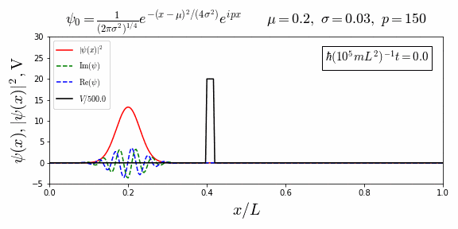

# Time Dependent Schrodinger Equation Simulation

## Description
A simulation of quantum tunnelling created with numpy, scipy, and matplotlib in Python. In the default simulation, a Gaussian wave packet can be seen tunnelling through a potential barrier approximately 3000x its maximum amplitude. The time dependent Schrodinger equation is solved as an eigenvalue problem and the solution is reconstructed through the weighted sums of the time-independent energy eigenvalues and eigenstates, which are multiplied by a time dependent phase factor. 

## Setup
This project is done in Jupyter, but can also be run in any Python interpreter with the correct dependencies installed.

To install Jupyter, head to https://jupyter.org/install.

Otherwise, to install the necessary libraries:

`pip install numpy scipy matplotlib`

## Examples
Rectangular barrier

Finite square well. Interestingly, the simulation seems to converge to the time independent solution consisting of standing waves.

Quadratic potential

Other examples (the Lennard-Jones and Wood-Saxon potentials) can be found in the `examples` folder.

## Inspiration
This project was mainly inspired by this YouTube  from Mr. P Solver, as well as various other online sources.

## Issues
* The edges reflect the wavefunction, interfering with the simulation in the middle
* The GIF files produced have a massive file size before compression

## Version Info
* Python 3.7.3
* Jupyter core 4.6.3
